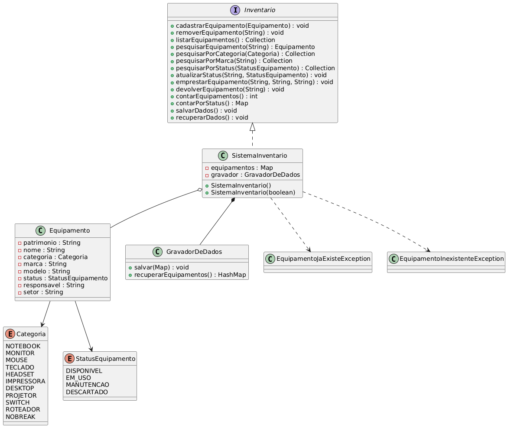

# SIGETI — Sistema de Gerenciamento de Equipamentos de TI

## Descrição

Mini sistema desenvolvido para a disciplina de **Programação Orientada a Objetos (POO)** da **Universidade Federal da Paraíba (UFPB)**, período **2026.1**.

O sistema permite o gerenciamento de equipamentos de TI (notebooks, monitores, mouses, teclados, headsets, impressoras, desktops, projetores, switches, roteadores e nobreaks), oferecendo cadastro, pesquisa (por patrimônio, categoria, marca ou status), remoção, listagem, controle de empréstimo/devolução e persistência de dados em arquivo, por meio de uma **interface gráfica (GUI)** desenvolvida com **Java Swing**.

O objetivo é simular o controle patrimonial de equipamentos de TI de uma empresa ou instituição, incluindo o rastreio de quem está com cada equipamento emprestado e em qual setor está sendo utilizado.

---

## Funcionalidades

- ✅ Cadastro de equipamentos
- ✅ Pesquisa por patrimônio
- ✅ Pesquisa por categoria (usando Streams)
- ✅ Pesquisa por marca (usando Streams)
- ✅ Pesquisa por status (usando Streams)
- ✅ Remoção de equipamentos
- ✅ Listagem de todos os equipamentos
- ✅ Atualização de status de um equipamento
- ✅ Empréstimo de equipamento (associa responsável e setor, muda status para EM_USO)
- ✅ Devolução de equipamento (limpa responsável/setor, muda status para DISPONIVEL)
- ✅ Contagem total de equipamentos cadastrados
- ✅ Contagem de equipamentos agrupados por status (usando Streams/Collectors)
- ✅ Persistência dos dados em arquivo (`equipamentos.dat`), com recuperação automática ao iniciar
- ✅ Tela inicial com atalhos para as principais ações
- ✅ Interface gráfica utilizando Swing, com submenu de pesquisas
- ✅ Tratamento de exceções personalizadas
- ✅ Testes automatizados com JUnit 5

---

## Interface gráfica

O sistema possui uma tela inicial (`TelaInicial`) com atalhos para as ações mais usadas (Cadastrar, Pesquisar, Emprestar, Listar), e uma janela principal (`TelaPrincipal`) construída com **Java Swing**, organizada por meio de uma barra de menus.

### Arquivo
- Salvar Dados
- Sair (salva automaticamente antes de fechar, inclusive ao clicar no X da janela)

### Equipamentos
- Cadastrar Equipamento
- Remover Equipamento
- Listar Equipamentos
- Emprestar Equipamento
- Devolver Equipamento

### Pesquisar
- Por Patrimônio
- Por Categoria
- Por Marca
- Por Status

Cada opção do menu é tratada por um **Controller**, responsável por:

- receber as informações do usuário através de `JOptionPane`;
- invocar as operações da interface `Inventario`;
- tratar possíveis exceções;
- exibir mensagens de sucesso ou erro ao usuário.

Ao iniciar, o sistema tenta recuperar automaticamente os dados salvos anteriormente; caso o arquivo ainda não exista (primeira execução), o sistema inicia com um inventário vazio, sem gerar erro.

---

## Estrutura do projeto

```text
src/
├── main/
│   ├── java/
│   │   └── sistema_gerenciamento_de_equipamentos_ti/
│   │       ├── Inventario.java
│   │       ├── SistemaInventario.java
│   │       ├── Equipamento.java
│   │       ├── Categoria.java
│   │       ├── StatusEquipamento.java
│   │       ├── GravadorDeDados.java
│   │       ├── EquipamentoJaExisteException.java
│   │       ├── EquipamentoInexistenteException.java
│   │       │
│   │       ├── controller/
│   │       │   ├── InventarioAddController.java
│   │       │   ├── InventarioSearchController.java
│   │       │   ├── InventarioRemoveController.java
│   │       │   ├── InventarioListController.java
│   │       │   ├── InventarioEmprestarController.java
│   │       │   ├── InventarioDevolverController.java
│   │       │   ├── InventarioPesquisarPorCategoriaController.java
│   │       │   ├── InventarioPesquisarPorMarcaController.java
│   │       │   └── InventarioPesquisarPorStatusController.java
│   │       │
│   │       └── gui/
│   │           ├── TelaInicial.java
│   │           ├── TelaPrincipal.java
│   │           └── Aplicacao.java
│   │
│   └── resources/
│       └── imgs/
│           └── logo.png
│
└── test/
    └── java/
        └── sistema_gerenciamento_de_equipamentos_ti/
            └── SistemaInventarioTest.java
```

---

## Diagrama de Classes UML



---

## Principais classes

### Inventario

Interface que define o contrato do sistema (padrão fachada), reunindo 14 operações principais:

- cadastrar, remover e listar equipamentos;
- pesquisar por patrimônio, categoria, marca e status;
- atualizar status, emprestar e devolver equipamentos;
- contar equipamentos (total e por status);
- salvar e recuperar dados.

Toda a interface está documentada com **Javadoc**.

---

### SistemaInventario

Classe responsável pela implementação das funcionalidades do sistema.

Utiliza um `HashMap<String, Equipamento>` para armazenar os equipamentos indexados pelo número de patrimônio. Possui dois construtores: um que recupera os dados salvos automaticamente (lançando `IOException` em caso de falha real de leitura), e outro que inicia o inventário vazio, usado como alternativa segura quando a recuperação falha.

As pesquisas por categoria, marca e status, além da contagem por status, são implementadas com **Streams** (`filter`, `Collectors.toList()`, `Collectors.groupingBy()` e `Collectors.counting()`).

---

### Equipamento

Representa um equipamento do inventário.

Cada equipamento possui:

- patrimônio, nome, categoria, marca, modelo (definidos no cadastro, não mudam depois);
- status (disponível, em uso, em manutenção ou descartado);
- responsável e setor (preenchidos apenas quando o equipamento está emprestado).

A classe implementa `Serializable`, permitindo sua gravação e recuperação em arquivo.

---

### GravadorDeDados

Responsável pela persistência dos dados utilizando `ObjectOutputStream` e `ObjectInputStream`, com `try-with-resources`.

Os equipamentos são armazenados no arquivo `equipamentos.dat`. Se o arquivo ainda não existir (primeira execução), o método de recuperação devolve um `Map` vazio em vez de lançar erro. Se ocorrer um erro real de leitura ou gravação, os métodos lançam `IOException`.

---

### TelaInicial

Tela de boas-vindas do sistema, exibindo a logo (SIGETI) e botões de atalho para Cadastrar, Pesquisar, Emprestar e Listar equipamentos. Cada botão aciona a `TelaPrincipal` (mantida invisível) e simula o clique no item de menu correspondente via `doClick()`, reaproveitando os mesmos Controllers do menu completo.

---

### TelaPrincipal

Classe responsável pela interface gráfica principal do sistema.

Estende `JFrame`, monta a barra de menus (Arquivo, Equipamentos, Pesquisar) e delega cada operação para um controller específico. Garante que os dados sejam salvos automaticamente ao sair do sistema, seja pelo menu ou pelo botão de fechar da janela.

---

### Controllers

Cada controller implementa `ActionListener` e possui uma única responsabilidade (cadastrar, pesquisar, remover, listar, emprestar ou devolver equipamentos), seguindo o padrão **Controller** e separando a interface gráfica da lógica de negócio do sistema.

---

## Exceções personalizadas

- `EquipamentoJaExisteException` — lançada quando é feita uma tentativa de cadastrar um equipamento com patrimônio já existente.
- `EquipamentoInexistenteException` — lançada quando um equipamento não é encontrado durante uma pesquisa, remoção, atualização de status, empréstimo ou devolução.

---

## Testes

O projeto possui testes automatizados utilizando **JUnit 5**, cobrindo os principais métodos da interface `Inventario` (cadastro, pesquisas, remoção, empréstimo/devolução e persistência).

---

## Como executar

1. Clone este repositório.
2. Abra o projeto em uma IDE Java compatível (IntelliJ IDEA, VS Code, etc.).
3. Execute a classe `Aplicacao.java`, localizada no pacote `sistema_gerenciamento_de_equipamentos_ti.gui`.

---

## Tecnologias utilizadas

### Tecnologias
- Java 21
- Swing
- Maven
- JUnit 5

### Conceitos utilizados
- Programação Orientada a Objetos (POO)
- Interfaces e padrão fachada
- Coleções (`HashMap`)
- Streams e expressões lambda
- Serialização de Objetos (`Serializable`)
- Tratamento de Exceções
- Padrão Controller
- Interface gráfica com Swing

---

## Autora

**Isabella Lima**

Graduanda em **Sistemas de Informação**
**Universidade Federal da Paraíba (UFPB)**

GitHub: **@IsaMariaLS**